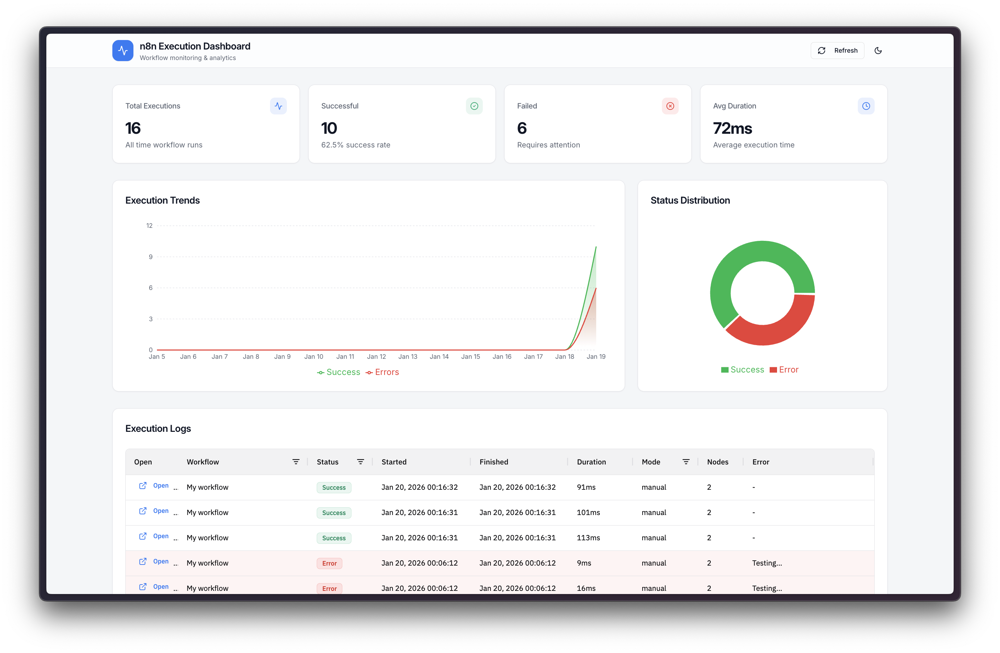

# n8n Execution Dashboard UI (Multi-Instance Fork)

Observability dashboard for monitoring n8n workflow executions, with **multi-instance** support.



## Project Origin

This project is a fork of [avanaihq/n8n-dashboard-anatlycis-ui](https://github.com/avanaihq/n8n-dashboard-anatlycis-ui), created by **[Avanai](https://avanai.io)** and **[Aemal Sayer](https://aemalsayer.com)** (CTO & Co-Founder, n8n Ambassador).

The original project was developed during a technical podcast to demonstrate how to build enterprise-level observability for n8n.

For the original n8n hooks configuration, see the companion repository: [avanaihq/n8n-dashboard-analytics](https://github.com/avanaihq/n8n-dashboard-analytics)

## Changes from Original

### Multi-Instance Support

The main modification is support for **multiple n8n instances** in a single dashboard:

| Feature | Description |
|---------|-------------|
| **Environment Selector** | Dropdown in header to filter by n8n instance |
| **Instance Column** | New column in table showing the source instance |
| **Color Coding** | Colored badges by environment (prod=red, staging=orange, dev=blue) |
| **Direct Links** | Links to execution in the corresponding n8n instance |
| **Auto-discovery** | Automatic detection of instances from database |

### Advanced Filters

- Filter by **workflow**
- Filter by **status** (success, error, running, waiting, canceled)
- Filter by **mode** (manual, trigger, webhook, etc.)
- Filter by **date range**
- **Dynamic statistics**: widgets update based on applied filters

### Database Schema

Added `n8n_instance` field to identify the source instance of each execution.

## Architecture

```
┌─────────────────┐     ┌─────────────────┐     ┌─────────────────┐
│  n8n Instance 1 │────▶│                 │     │                 │
│   (Production)  │     │                 │     │                 │
├─────────────────┤     │    Supabase     │────▶│  Dashboard UI   │
│  n8n Instance 2 │────▶│    Database     │     │   (this repo)   │
│    (Staging)    │     │                 │     │                 │
├─────────────────┤     │                 │     │                 │
│  n8n Instance 3 │────▶│                 │     │                 │
│      (Dev)      │     │                 │     │                 │
└─────────────────┘     └─────────────────┘     └─────────────────┘
```

Each n8n instance sends execution data via hooks to Supabase. The dashboard aggregates and visualizes data from all instances.

## Tech Stack

- **Frontend**: React 18, TypeScript, Vite
- **UI**: shadcn/ui, Tailwind CSS, Radix UI
- **Data Grid**: AG Grid Community
- **Charts**: Recharts
- **Backend**: Express.js
- **Database**: Supabase (PostgreSQL)
- **State**: TanStack Query

## Installation

### 1. Create Supabase Table

Run the following SQL in your Supabase SQL Editor:

```sql
CREATE TABLE n8n_execution_logs (
  id UUID PRIMARY KEY DEFAULT gen_random_uuid(),

  -- n8n instance identifier
  n8n_instance TEXT,

  -- Execution info
  execution_id TEXT NOT NULL,
  workflow_id TEXT NOT NULL,
  workflow_name TEXT NOT NULL,

  -- Status
  status TEXT NOT NULL CHECK (status IN ('success', 'error', 'running', 'waiting', 'canceled')),
  finished BOOLEAN DEFAULT false,

  -- Timing
  started_at TIMESTAMPTZ,
  finished_at TIMESTAMPTZ,
  duration_ms INTEGER,

  -- Metadata
  mode TEXT,
  node_count INTEGER,
  error_message TEXT,

  -- Detailed data (JSONB)
  execution_data JSONB,
  workflow_data JSONB,

  created_at TIMESTAMPTZ DEFAULT NOW(),

  CONSTRAINT unique_execution UNIQUE (execution_id)
);

-- Performance indexes
CREATE INDEX idx_execution_logs_instance ON n8n_execution_logs(n8n_instance);
CREATE INDEX idx_execution_logs_workflow_id ON n8n_execution_logs(workflow_id);
CREATE INDEX idx_execution_logs_status ON n8n_execution_logs(status);
CREATE INDEX idx_execution_logs_created_at ON n8n_execution_logs(created_at DESC);
```

### 2. Configure Environment Variables

Create a `.env` file:

```env
SUPABASE_URL=https://your-project.supabase.co
SUPABASE_SERVICE_KEY=your-service-role-key
PORT=5000
```

> Use the **Service Role Key** (not the anon key)

### 3. Run the Project

```bash
npm install
npm run dev
```

The dashboard will be available at `http://localhost:5000`.

## n8n Hooks Configuration

To send execution data to Supabase, you need to configure hooks in your n8n instance.

### Using execution-hooks.js

This repository includes an `execution-hooks.js` file that handles the `workflow.postExecute` hook to log all executions to Supabase.

**Setup:**

1. Copy `execution-hooks.js` to your n8n external hooks directory

2. Configure your n8n instance to use the hooks file. In your n8n environment:

```env
# Required for hooks
EXTERNAL_HOOK_FILES=/path/to/execution-hooks.js

# Required for Supabase logging
SUPABASE_URL=https://your-project.supabase.co
SUPABASE_SERVICE_KEY=your-service-role-key

# Required for multi-instance identification
N8N_HOST=https://your-n8n-instance.com
```

3. Restart your n8n instance

The hook will automatically:
- Capture all workflow executions (success and error)
- Record execution duration, status, node count, error messages
- Store the full execution data as JSONB
- Identify the source instance via `N8N_HOST`

For more details on n8n hooks configuration, see:
- [avanaihq/n8n-dashboard-analytics](https://github.com/avanaihq/n8n-dashboard-analytics) - Original hooks setup
- [n8n External Hooks Documentation](https://docs.n8n.io/hosting/configuration/configuration-examples/external-hooks/)

## Scripts

| Command | Description |
|---------|-------------|
| `npm run dev` | Start development server with HMR |
| `npm run build` | Build for production |
| `npm run start` | Run production build |
| `npm run check` | TypeScript type checking |

## Project Structure

```
server/           # Express backend
  index.ts        # App setup, middleware
  routes.ts       # API endpoints (5 routes)
  supabase.ts     # Supabase client
client/src/       # React frontend
  pages/          # Pages (dashboard, not-found)
  components/     # UI components
  lib/            # Utilities
shared/           # Shared types
  schema.ts       # TypeScript types, Zod validators
execution-hooks.js  # n8n hooks file for Supabase logging
```

## API Endpoints

| Route | Description |
|-------|-------------|
| `GET /api/instances` | List of n8n instances |
| `GET /api/executions?instance=` | Execution logs (filterable by instance) |
| `GET /api/executions/stats?instance=` | Aggregated statistics |
| `GET /api/executions/daily?instance=` | Daily statistics |
| `GET /api/executions/workflows?instance=` | Per-workflow statistics |

## Credits

- **Original project**: [Avanai](https://avanai.io) - [Aemal Sayer](https://aemalsayer.com)
- **Original repository**: [github.com/avanaihq/n8n-dashboard-anatlycis-ui](https://github.com/avanaihq/n8n-dashboard-anatlycis-ui)
- **Original hooks setup**: [github.com/avanaihq/n8n-dashboard-analytics](https://github.com/avanaihq/n8n-dashboard-analytics)

## Resources

- [n8n Documentation](https://docs.n8n.io/)
- [n8n External Hooks](https://docs.n8n.io/hosting/configuration/configuration-examples/external-hooks/)
- [Supabase Documentation](https://supabase.com/docs)
